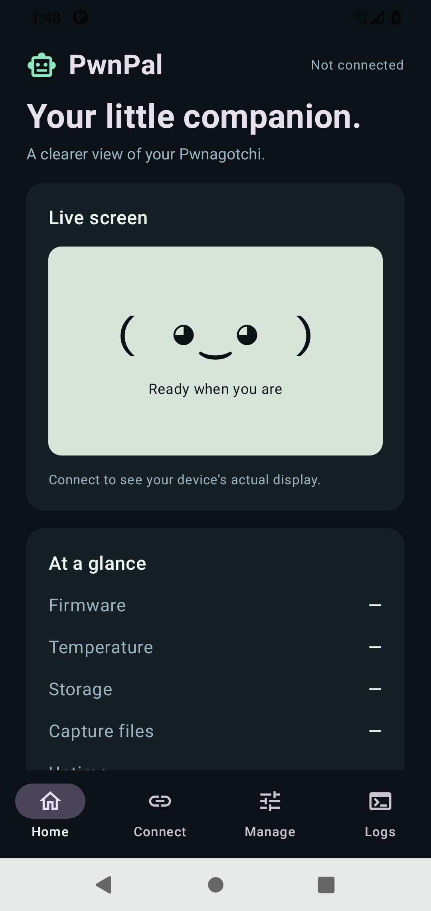

# PwnPal · 0.2.1 beta

A native Android companion for a Pwnagotchi running jayofelony 2.9.5.4. Built with Kotlin and Jetpack Compose, with a dark interface and a side-by-side dashboard on wider screens.

## 0.2.1 fixes

- Bound SSH stdout and stderr buffering, including stderr-only failures.
- Keep pending exports as private snapshots across activity recreation; missing snapshots fail before opening the destination.
- Disable action confirmations during another operation and report busy requests explicitly.
- Detect closed SSH sessions, clear stale readings, and return Connect to reconnect mode.
- Use one shared configuration lock across plugin transactions and full configuration saves; verify install/remove results before reporting success.

## Screenshot



*Home screen in the Android emulator, before connecting a device. Captured before the final status-bar contrast fix.*

## Features

- One saved device profile with Android Keystore encrypted credentials.
- SSH host fingerprint confirmation before password authentication; changed identities require explicit confirmation.
- Guided Bluetooth, USB, and Wi-Fi connection instructions and Android settings shortcuts.
- Actual device screen from `/ui`, carried through an SSH tunnel bound to loopback.
- Service status, detected firmware version, uptime, temperature, free storage, and capture-file count.
- Foreground dashboard refresh every 15 seconds. No background connection service.
- Service restart, scheduled reboot/shutdown, and cancellation of a scheduled power action.
- Latest 150 systemd service log lines and Android document-picker export.
- Full TOML configuration editor with Python `tomllib` validation, SHA-256 conflict checking, a private device-side backup, atomic replacement, and export.

## Install and connect

1. Install the accompanying APK on Android 8 or newer. Android may ask you to allow installation from the app opening the APK.
2. Establish a network path from your phone to the Pwnagotchi. The app cannot enable tethering on your behalf.
3. Open **Connect**. Enter the device IP or hostname, SSH port, username, and password. No default password is assumed.
4. Web port is normally `8080`. Leave web credentials blank if web authentication is disabled; otherwise enter your web UI credentials, which can differ from SSH credentials.
5. Tap **Connect securely**. Compare the displayed SSH fingerprint with the device, then accept it. For an Ed25519 key, run this on the device: `ssh-keygen -lf /etc/ssh/ssh_host_ed25519_key.pub`. If the server negotiates a different host-key type, compare that corresponding `.pub` file instead.
6. Open **Home**. If SSH succeeds but the screen fails, check the web UI port, credentials, and whether `ui.web.enabled` is true.

### Bluetooth

Pair through Android settings, enable Bluetooth tethering, and configure the device's bt-tether plugin for your phone. Pairing alone is insufficient. Use the device's actual Bluetooth-side IP. This app does not configure the device's first network connection while it is unreachable.

### USB

Use the Pwnagotchi's data port, a data-capable cable, and a phone that supports the USB gadget's network interface. Android USB networking support varies; a powered screen does not prove there is a network connection. The app does not include a USB Ethernet driver.

### Administration

The device must provide Python 3.11+ (including tomllib), systemd, and an SSH server permitting local port forwarding. Configuration, logs, and controls use non-interactive `sudo -n`; they require an already-authorized account. The app never changes sudoers. Without sufficient permissions it explains the error; some health information can still be read.

**Power controls intentionally schedule reboot/shutdown one minute ahead**, allowing cancellation and allowing SSH to report whether the command was accepted.

## Plugins

Open **Manage → Manage plugins** to list built-in and custom plugins, enable/disable them in configuration, or remove custom plugins. Built-in files cannot be replaced or removed. Restart the service explicitly to apply changes; configured state does not prove a plugin is currently running.

Under **Install**, enter a public GitHub repository (`owner/repository`) to browse Python files, or paste a GitHub/raw `.py` file URL and a plugin name. Repository browsing pins downloads to a commit. Review the source, author-supplied metadata, and SHA-256 before confirming. Installation and updates save the plugin as **disabled**. Configure its options in **Manage → Configuration**, then enable it and restart the service.

This installer supports individual UTF-8 Python plugins up to 256 KiB. It does not install dependencies, ZIP archives, resource bundles, or multi-file packages. Check the author's instructions and firmware compatibility. Python syntax and subclass checks do not establish safety: enabled plugins run privileged code on the device. Only use sources you trust.

Existing custom files are backed up privately under `/etc/pwnagotchi/pwnpal-plugin-backups/` before replacement or removal. Configuration changes also use the normal configuration backups. Conflicting `conf.d` overrides, built-in name collisions, symlink targets, and stale reviewed/configuration hashes are rejected. If a file operation fails after saving its disabled configuration, the error identifies the configuration backup. Backups require manual restoration on the device.

Plugin changes require `tomlkit` in the firmware Python environment. The app uses `/home/pi/.pwn/bin/python3` when available, otherwise system Python. It never installs Python packages automatically. Public GitHub browsing/downloads use the phone's internet connection and unauthenticated GitHub rate limits; they do not need a GitHub login. No plugin code executes during inspection.

## Optional support

A small **Support PwnPal** link sits at the bottom of Manage. It opens Bitcoin and Monero QR codes, copy-address buttons, and wallet links using the Wardriver donation addresses. There are no donation prompts or dashboard banners.

## Configuration safety

The app reads `/etc/pwnagotchi/config.toml`. Save validates TOML syntax on the device, rejects empty/oversized content, checks that the loaded file has not changed, creates a mode-0600 backup under `/etc/pwnagotchi/pwnpal-backups/`, and atomically replaces the configuration. The new permissions retain the original owner/group bits restricted to 0660. No automatic restart occurs. Existing backup files are not automatically deleted.

TOML syntax validation is **not** validation of all Pwnagotchi/plugin semantics. A syntactically valid wrong setting can prevent startup or networking. Keep the exported backup and access to the SD card. Do not change connectivity settings without a recovery path. Exported TOML may contain passwords/API keys. Logs can include network identifiers.

Configuration compare-and-swap detects changes since loading; advisory locking coordinates PwnPal saves but cannot lock out unrelated editors that ignore that lock. The full editor preserves unknown plugin options because it edits the original text.

## Current boundaries

This is a beta, not yet verified against a physical Pwnagotchi or Pixel Fold. Version-specific integration was inspected against upstream tag v2.9.5.4. Capture count means `.pcap`/`.pcapng` files, not independently validated handshakes. Missing data is shown as unavailable.

Not included yet: multi-device profiles, SSH private-key import, automatic Bluetooth provisioning, native plugin-specific forms, capture downloads, or mode-switch controls. The connection choices provide setup guidance; they do not create an Android network interface. Live screen and monitoring require the device to be reachable.

The app has no analytics, cloud account, advertising, or app-operated capture uploads. Android app backup is disabled. SSH encrypts management and the live screen in transit. Saved passwords are encrypted with Android Keystore. Device configuration remains governed by the device's own permissions.

## Build

Requirements: JDK 17, Android SDK platform 35 and build-tools 35.0.0. Android Gradle Plugin 8.9.2, Gradle 8.11.1, Kotlin 2.1.20.

```sh
printf 'sdk.dir=%s\n' "$ANDROID_SDK_ROOT" > local.properties
./gradlew assembleDebug testDebugUnitTest lintDebug
python3 -m pip install -r tests/requirements.txt
python3 -m unittest discover -s tests -v
```

Open the root folder in Android Studio for editing. The wrapper is included. First build requires access to Google Maven, Maven Central, and Gradle distributions.

## Release signing

The 0.2.1 beta release APK is non-debuggable and signed with the Wardriver HexDroid release key. Its signing certificate SHA-256 is:

```text
6b59ea42d196af4545fb3d27924b13921db94740c8a82fb5302086c311dea02a
```

The original debug-signed beta used a different key. Uninstall that debug build before installing the release-signed build; uninstalling clears saved settings. Future release updates must use the same release key.

Build an unsigned release with `./gradlew assembleRelease`. Align and sign it with Android SDK `zipalign` and `apksigner`, keeping the keystore and credentials outside this repository. The signing key, password, and recovery archive are not included in the source. This remains beta software; release signing does not imply hardware validation.

## Sources and dependencies

- Firmware target: https://github.com/jayofelony/pwnagotchi/tree/v2.9.5.4
- Web interface inspected: `pwnagotchi/ui/web/handler.py` (`GET /ui`).
- Firmware configuration defaults: `pwnagotchi/defaults.toml`.
- Android / Compose: https://developer.android.com/jetpack/compose
- SSH implementation: https://github.com/mwiede/jsch (BSD-style license).
- EdDSA compatibility provider: https://github.com/str4d/ed25519-java (CC0).

Independent companion app; not an official Pwnagotchi project release. All device-management use should be on devices you own or administer.
